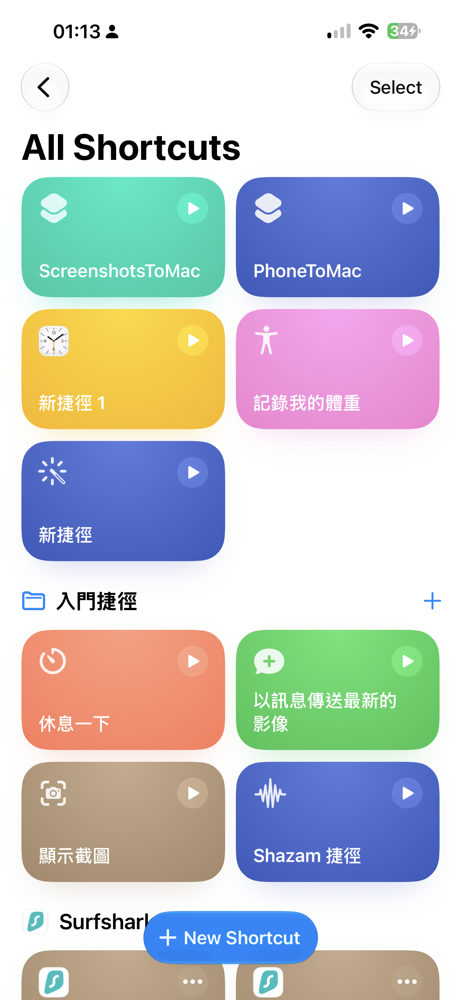
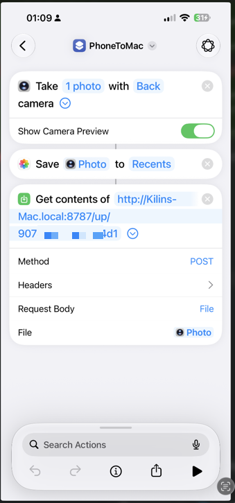
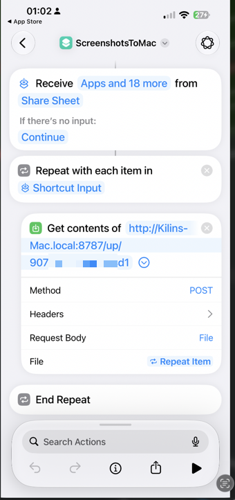
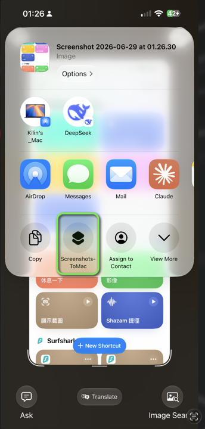

# iphone-to-mac

Snap a photo or screenshot on your iPhone → it's on your Mac in <1s, over LAN (no cloud).

Requires an iPhone + a Mac on the same Wi-Fi.

## Two ways to send
- **Photo** — Action Button → snap → sent.
- **Screenshot / any image** — Share Sheet → pick `ScreenshotsToMac` (multiple at once OK).

## Set up on Mac
1. Run `./install.sh` — it generates a token, installs the launchd agent, and prints your Shortcut URL.
2. Copy that URL; you'll paste it into the Shortcuts below.

## Set up on iPhone — Shortcut 1: Photo (Action Button)

1. New Shortcut, add **Take Photo** (Back camera, Show Camera Preview on).
2. Add **Save to Photo Album** (optional — keeps a copy in Photos).
3. Add **Get Contents of URL**:
   - URL = the one from `install.sh`
   - Method = **POST**
   - Request Body = **File**
   - File = **Photo**
4. Settings → Action Button → Shortcut → pick this shortcut.

## Set up on iPhone — Shortcut 2: Screenshot / any image (Share Sheet)

 

1. New Shortcut; tap **ⓘ** → turn on **Show in Share Sheet**.
2. Add **Repeat with Each** (over `Shortcut Input`).
3. Inside the loop, add **Get Contents of URL**:
   - URL = same one
   - Method = **POST**
   - Request Body = **File**
   - File = **Repeat Item**
4. Use it: screenshot → tap **Share** → pick **ScreenshotsToMac** (right image).

## Config to change
- `phone-receiver.py`: `PORT` (default 8787), `DEST_ROOT`
- Shortcut URL: `http://<your-mac>.local:8787/up/<token>`

## Use
1. Photo: press the Action Button. Screenshot/image: Share → `ScreenshotsToMac`.
2. Lands in `photos/<date>/<time>.jpg` (HEIC auto-converted to jpg).

## Troubleshooting (rarely needed)
- Stuck / not receiving? Double-click `restart-server.command`. Check both devices are on the same Wi-Fi.
- `.local` not resolving on your network? Use the Mac's LAN IP in the Shortcut URL instead.

────

# iphone-to-mac

iPhone 拍照或截圖 → 1 秒內到 Mac，走區網、不經雲端。需要 iPhone + Mac 同一個 Wi-Fi。

## 兩種傳法
- **拍照** — 按 Action 按鈕 → 拍 → 傳出。
- **截圖／任何圖片** — 分享選單 → 選 `ScreenshotsToMac`（可一次多張）。

## 在 Mac 設定
1. 跑 `./install.sh` — 會產 token、裝 launchd 服務、印出你的 Shortcut 網址。
2. 複製那串網址，等下貼進下面的捷徑。

## 在 iPhone 設定 — 捷徑 1：拍照（Action 按鈕）

（對應上方左圖）

1. 新增捷徑，加 **Take Photo**（後鏡頭、開 Show Camera Preview）。
2. 加 **Save to Photo Album**（可選，在相簿留一份）。
3. 加 **Get Contents of URL**：
   - URL = `install.sh` 印出來那串
   - Method = **POST**
   - Request Body = **File**
   - File = **Photo**
4. 設定 → 動作按鈕 → 捷徑 → 選這個捷徑。

## 在 iPhone 設定 — 捷徑 2：截圖／任何圖片（分享選單）

（對應上方兩張圖：左＝設定，右＝使用）

1. 新增捷徑；點 **ⓘ** → 打開 **Show in Share Sheet**。
2. 加 **Repeat with Each**（對 `Shortcut Input`）。
3. 在迴圈裡加 **Get Contents of URL**：
   - URL = 同一串
   - Method = **POST**
   - Request Body = **File**
   - File = **Repeat Item**
4. 用法：截圖 → 點 **分享** → 選 **ScreenshotsToMac**（右圖）。

## 要改的設定
- `phone-receiver.py`：`PORT`（預設 8787）、`DEST_ROOT`
- Shortcut 網址：`http://<你的-mac>.local:8787/up/<token>`

## 使用
1. 拍照按 Action 按鈕；截圖／圖片用分享選單選 `ScreenshotsToMac`。
2. 存到 `photos/<日期>/<時間>.jpg`（HEIC 自動轉 jpg）。

## 疑難排解（很少用到）
- 卡住／沒收到？點兩下 `restart-server.command`，並確認兩台同一個 Wi-Fi。
- 你的網路擋 `.local`？改用 Mac 的區網 IP 當 Shortcut 網址。
